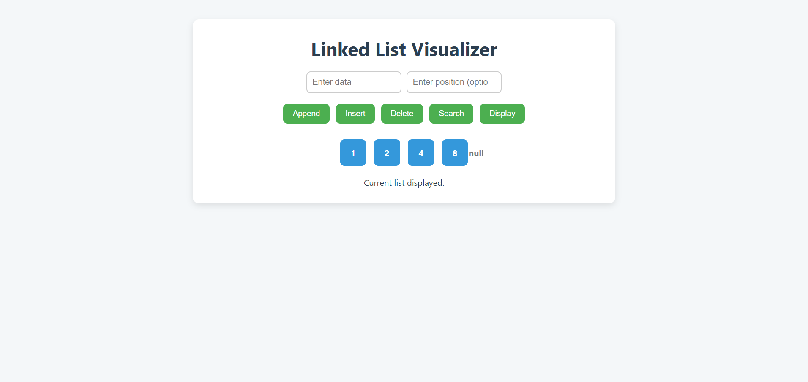

# 🔗 Linked List Visualizer

An interactive and modern **Linked List visualizer** built using **HTML, CSS, and JavaScript**.  
This project allows users to perform all basic linked list operations — with real-time visualization and smooth UI/UX.

---

## ✨ Features

- ✅ Append node to the list
- ✅ Insert node at any position
- ✅ Delete node at any position
- ✅ Search for a node (with highlight)
- ✅ Visual display of linked list (`[data] → [data] → null`)
- ✅ Input validation and user-friendly status updates
- ✅ Responsive layout for desktop and mobile
- ✅ Clean and modern UI

---

## 🚀 Live Demo

🌐 [Click here to view the live project](https://smith-droid.github.io/linked-list-visualizer)

---

## 🧠 Tech Stack

- HTML5
- CSS3 (Flexbox, responsive design)
- JavaScript (ES6)

---

## 📸 Screenshots

  
*Append, insert, delete and search nodes visually.*

---

## 🛠️ How to Run Locally

1. Clone the repository:
   
   git clone https://github.com/Smith-droid/linked-list-visualizer.git

2. Open index.html in your browser (no server needed).

---

## 🙋‍♂️ Author

- **Name**: Smith Popat
- **GitHub**: [Smith-droid](https://github.com/Smith-droid)
